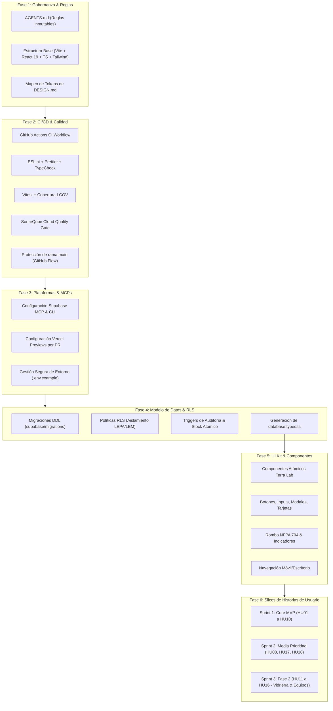

# 🛡️ Plan Maestro: Desarrollo Seguro Asistido por Inteligencia Artificial
### Sistema de Gestión Automatizado LEPA-LEM (IZT - UCV)

> [!IMPORTANT]
> **Restricción de Recursos:** Presupuesto estricto de **100 horas de desarrollo**.
> **Stack Tecnológico:** TypeScript, React 19, Node.js, PostgreSQL (Supabase) y Vercel / Cloudflare.
> **Objetivo:** Maximizar la autonomía y velocidad de los agentes de IA eliminando el riesgo de alucinación técnica, deuda de código, regresiones de diseño o fallos de seguridad en base de datos.

---

## 1. Principios de Seguridad para el Desarrollo con Agentes IA

Para garantizar que múltiples agentes de IA colaboren en el repositorio sin generar inconsistencias o degradar la calidad:

1. **Gobernanza Nativa Incondicional:** Todos los agentes operarán bajo un archivo central `AGENTS.md` en la raíz del proyecto. Antigravity carga este archivo de forma automática al iniciar cada contexto.
2. **Type-Safety Estricto de Extremo a Extremo:** No se permite `any` en TypeScript. La base de datos genera automáticamente el archivo de tipos `database.types.ts`, asegurando que ningún agente invente tablas, columnas o parámetros inexistentes.
3. **Inmutabilidad y Versionado de Base de Datos:** Los agentes tienen prohibido ejecutar sentencias DDL directas (`DROP`, `ALTER`, `CREATE`) en entornos remotos. Toda alteración estructural debe residir en archivos SQL secuenciales en `supabase/migrations/`.
4. **Desarrollo por "Vertical Slices" (Rebanadas Verticales):** Se prohíbe el modelo en cascada tradicional (hacer todo el backend y luego todo el frontend). Cada funcionalidad se implementa por Historia de Usuario (DB + API + UI + Tests) en una rama independiente, validada mediante Pull Request.
5. **Quality Gates Automatizados:** Ningún código entra a la rama `main` sin superar pruebas unitarias, análisis estático de tipos, ESLint y el control de calidad de SonarQube Cloud.

---

## 2. Mapa de Fases de Ejecución

---

## 3. Detalle de Fases de Implementación

### Fase 1: Gobernanza, Reglas y Fundaciones
* **Archivo `AGENTS.md`:** Define estándares ineludibles:
  * Nomenclatura de **Conventional Commits** (`feat:`, `fix:`, `docs:`, `test:`, `refactor:`, `chore:`).
  * Directivas de TypeScript estricto (`strict: true`, prohibición explícita de `any`).
  * Estructura de directorios y reglas de importación.
  * Obligatoriedad de pruebas unitarias por componente o función crítica.
  * Referencia estricta a `DESIGN.md` para evitar interfaces desalineadas con la identidad del IZT.
* **Inicialización de Proyecto:**
  * Configuración de **Vite + React 19 + TypeScript**.
  * Instalación y configuración de **Tailwind CSS**, mapeando los colores (`surface`, `primary`, `on-surface-variant`), fuentes (`Literata`, `Nunito Sans`) y radios definidos en `DESIGN.md`.

### Fase 2: Pipeline de CI/CD y Flujo de Trabajo (GitHub Flow)
* **GitHub Actions (`.github/workflows/ci.yml`):**
  1. **Linter & TypeCheck:** `npm run lint` y `npx tsc --noEmit`.
  2. **Test Suite:** `npm run test:coverage` con Vitest y `@testing-library/react`.
  3. **SonarCloud Scan:** Verificación de Quality Gate (0 bugs, 0 vulnerabilidades, <3% deuda técnica, cobertura de código).
  4. **Build Verification:** `npm run build` garantizando que el paquete de producción compile sin advertencias de tipos.
* **Políticas de Repositorio:**
  * Rama `main` protegida contra `push` directo.
  * Todo cambio requiere Pull Request originada en ramas temáticas (`feat/hu01-auth`, `fix/alerta-umbral`).
  * Integración obligatoria de PRs pasando todos los checks de CI.

### Fase 3: Conexión con MCPs y Plataformas Cloud
* **Supabase MCP:**
  * Configurado en `~/.gemini/config/mcp_config.json` con permisos de consulta e inspección.
  * Utilizado por agentes para validar la estructura del esquema y depurar consultas.
  * Uso de **Supabase CLI** (`npx supabase`) para la creación y ejecución determinista de migraciones locales/remotas.
* **Vercel Previews:**
  * Vinculación del repositorio para generación automática de *Preview Deployments* por cada PR.
  * Verificación visual de wireframes en dispositivos reales antes de la fusión.

### Fase 4: Base de Datos Relacional y Políticas RLS
* **Migraciones SQL Iniciales (`supabase/migrations/`):**
  * `00001_tablas_maestras.sql`: Tablas de laboratorios (`LEPA`, `LEM`), roles y usuarios.
  * `00002_catalogo_reactivos.sql`: Catálogo institucional único con NFPA 704, clasificación de sustancias reguladas (`RESQUIMIC`, `CICPC`, etc.) y último precio (`USD`/`VES`).
  * `00003_inventario_stock.sql`: Stock físico por laboratorio, umbral mínimo de alerta y fecha de caducidad.
  * `00004_bitacora_movimientos.sql`: Registro inmutable de consumos y movimientos.
  * `00005_prestamos.sql`: Registro general de préstamos (frasco completo vs. fracción/alícuota).
* **Seguridad RLS (Row Level Security):**
  * Cada consulta autenticada opera exclusivamente sobre el laboratorio activo del usuario.
  * Aislamiento criptográfico y relacional de existencias físicas.
* **Tipado Automático:**
  * Comando `npx supabase gen types typescript --local > src/types/database.types.ts`.

### Fase 5: Biblioteca de Componentes Base (UI Kit)
* Implementación en `src/components/ui/` siguiendo estrictamente `DESIGN.md`:
  * `Button`: Estilo `rounded-xl`, variantes `primary`, `secondary`, `outline`, con hover traducido (-4px) y soporte de carga.
  * `Input` & `Select`: Radio 1.5rem, etiquetas Nunito Sans 14px en negrita, soporte para errores y validaciones.
  * `NFPA704Diamond`: Visualización gráfica estándar de 4 cuadrantes para riesgo de reactivos.
  * `Card` & `Container`: Estructuras con tonalidad `surface-warm` y `surface-container-high`.
  * `StatusBadge`: Etiquetas visuales para reactivos regulados, stock bajo umbral y fechas próximas a vencer.
  * `BottomNavigation` / `TopBar`: Navegación ergonómica móvil y escritorio con selector de contexto (LEPA/LEM).

### Fase 6: Desarrollo Modular por Slices Ágiles (100h)
* **Sprint 1 (Horas 0-45) - MVP Core:**
  * `feat/hu01-auth`: Login con Supabase Auth y selector de contexto de laboratorio.
  * `feat/hu02-hu03-catalogo`: Catálogo unificado, rombo NFPA, reactivos regulados y validación de unicidad.
  * `feat/hu04-hu07-stock-alertas`: Stock físico local y sistema de advertencia persistente ($0 < \text{stock} \le \text{umbral}$).
  * `feat/hu05-hu06-consumo-bitacora`: Registro de consumo atómico y bitácora inmutable de auditoría.
  * `feat/hu09-hu10-prestamos`: Préstamos a terceros (frasco completo vs. fracción) y proceso de devolución.
* **Sprint 2 (Horas 46-75) - Media Prioridad:**
  * `feat/hu08-vencimientos`: Avisos y filtros de reactivos por caducidad.
  * `feat/hu17-reportes`: Exportación en cliente a PDF (membretado IZT) y CSV valorizado.
  * `feat/hu18-miscelaneos`: Inventario de artículos consumibles con unidades personalizables.
* **Sprint 3 (Horas 76-100) - Fase 2 (Vidriería y Equipos):**
  * `feat/hu11-hu12-vidrieria`: Stock en uso vs. reserva y registro de bajas/roturas.
  * `feat/hu13-hu16-equipos`: Catálogo de activos, bitácora de uso diario y calendario de calibraciones.

---

## 4. Matriz de Mitigación de Riesgos con Agentes IA

| Riesgo Identificado | Impacto | Estrategia de Mitigación |
| :--- | :--- | :--- |
| **Alucinación de esquemas / campos inexistentes** | Alto | Generación automática de `database.types.ts` + `tsc --noEmit` en CI. |
| **Pérdida de datos o DDL accidental en Supabase** | Crítico | Prohibición de DDL directo; solo migraciones versionadas en `supabase/migrations/`. |
| **Desviación estética respecto a wireframes** | Medio | Adherencia estricta a `DESIGN.md` y UI Kit base verificado antes de maquetar vistas. |
| **Regresiones funcionales o bugs desapercibidos** | Alto | Pruebas unitarias obligatorias (Vitest) y SonarCloud Quality Gate antes del merge. |
| **Sobrepasar el presupuesto de 100 horas** | Alto | Priorización estricta por historias Core MVP; descarte de features secundarias a Fase 2. |
| **Ruptura del contexto de laboratorio (LEPA vs LEM)** | Alto | Políticas RLS en PostgreSQL evaluadas con el UID y rol del usuario. |
