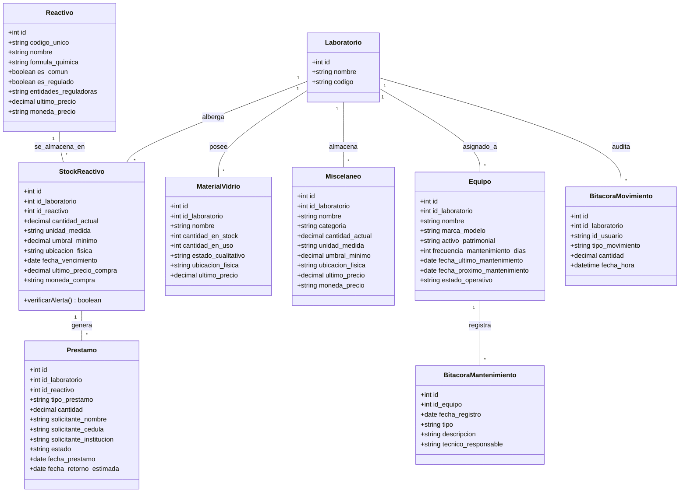

```mermaid
classDiagram
    class Laboratorio {
        +int id
        +string nombre
        +string codigo
    }

    class Reactivo {
        +int id
        +string codigo_unico
        +string nombre
        +string formula_quimica
        +boolean es_comun
        +boolean es_regulado
        +string entidades_reguladoras
        +decimal ultimo_precio
        +string moneda_precio
    }

    class StockReactivo {
        +int id
        +int id_laboratorio
        +int id_reactivo
        +decimal cantidad_actual
        +string unidad_medida
        +decimal umbral_minimo
        +string ubicacion_fisica
        +date fecha_vencimiento
        +decimal ultimo_precio_compra
        +string moneda_compra
        +verificarAlerta() boolean
    }

    class Prestamo {
        +int id
        +int id_laboratorio
        +int id_reactivo
        +string tipo_prestamo
        +decimal cantidad
        +string solicitante_nombre
        +string solicitante_cedula
        +string solicitante_institucion
        +string estado
        +date fecha_prestamo
        +date fecha_retorno_estimada
    }

    class MaterialVidrio {
        +int id
        +int id_laboratorio
        +string nombre
        +int cantidad_en_stock
        +int cantidad_en_uso
        +string estado_cualitativo
        +string ubicacion_fisica
        +decimal ultimo_precio
    }

    class Miscelaneo {
        +int id
        +int id_laboratorio
        +string nombre
        +string categoria
        +decimal cantidad_actual
        +string unidad_medida
        +decimal umbral_minimo
        +string ubicacion_fisica
        +decimal ultimo_precio
        +string moneda_precio
    }

    class Equipo {
        +int id
        +int id_laboratorio
        +string nombre
        +string marca_modelo
        +string activo_patrimonial
        +int frecuencia_mantenimiento_dias
        +date fecha_ultimo_mantenimiento
        +date fecha_proximo_mantenimiento
        +string estado_operativo
    }

    class BitacoraMantenimiento {
        +int id
        +int id_equipo
        +date fecha_registro
        +string tipo
        +string descripcion
        +string tecnico_responsable
    }

    class BitacoraMovimiento {
        +int id
        +int id_laboratorio
        +string id_usuario
        +string tipo_movimiento
        +decimal cantidad
        +datetime fecha_hora
    }

    %% Relaciones y Multiplicidad
    Laboratorio "1" -- "*" StockReactivo : alberga
    Reactivo "1" -- "*" StockReactivo : se_almacena_en
    StockReactivo "1" -- "*" Prestamo : genera
    
    Laboratorio "1" -- "*" MaterialVidrio : posee
    Laboratorio "1" -- "*" Miscelaneo : almacena
    Laboratorio "1" -- "*" Equipo : asignado_a
    Equipo "1" -- "*" BitacoraMantenimiento : registra
    Laboratorio "1" -- "*" BitacoraMovimiento : audita
```
